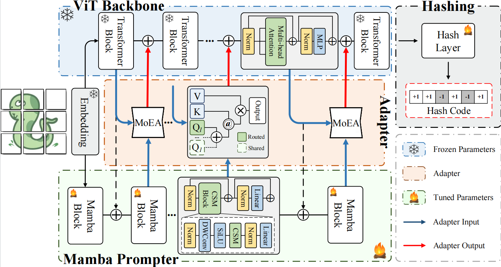
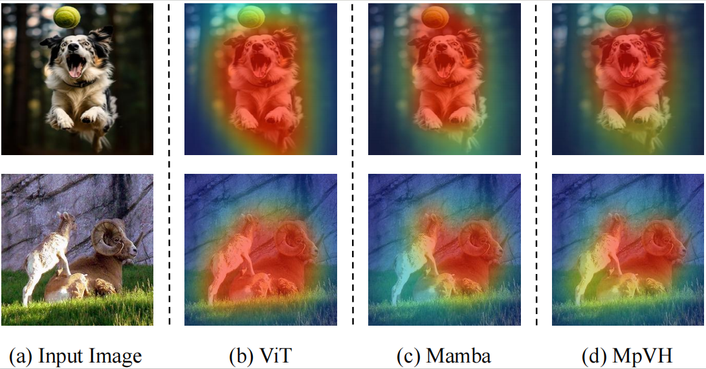

# MpVH: Mamba Dynamically Prompted Vision Transformer Hashing for Imgae Retrieval

We have initially released the code for each module of MpVH, including the ViT backbone, the Mamba prompt module, and the adapter. Upon publication of this paper, we will further release the complete MpVH model along with detailed usage instructions.

## Overall Structure of HGNet

## Intorduction
Most existing methods focus on optimizing the distribution of hash codes in the Hamming space, while overlooking the loss of discriminative information in image descriptors during the hashing process. To address this issue, we propose Mamba dynamically prompted Vision Transformer hashing (MpVH) for image retrieval. MpVH performs prompt learning by exploiting the sensitivity differences between network architectures to image information, thereby enhancing the ability of image descriptors to selectively represent image information. Specifically, MpVH leverages a Mamba prompter to generate discriminative prompts for local regions of the image. These prompts then guide the feature extraction process of the Vision Transformer, reducing the loss of discriminative information during hashing process by compressing and enhancing the visual representation of image descriptors. Moreover, to reduce the semantic gap between the outputs of the two network architectures, we design a dynamic mixture-of-experts adapter (MoEA). It is also capable of dynamically modeling long-range dependencies among prompts and reducing prompt redundancy through its internal mixture-of-experts module. Finally, we conduct extensive comparative experiments on three benchmark datasets, and the results demonstrate that our method outperforms existing deep hashing methods, achieving higher retrieval accuracy and superior encoding efficiency.

## Visualization

We input the image into (b) ViT, (c) Mamba, and (d) MpVH, and visualize the attention regions of their output features. The results indicate that MpVH integrates the advantages of (b) and (c), producing more compact attention regions and effectively reducing the loss of discriminative information during hash code generation.
